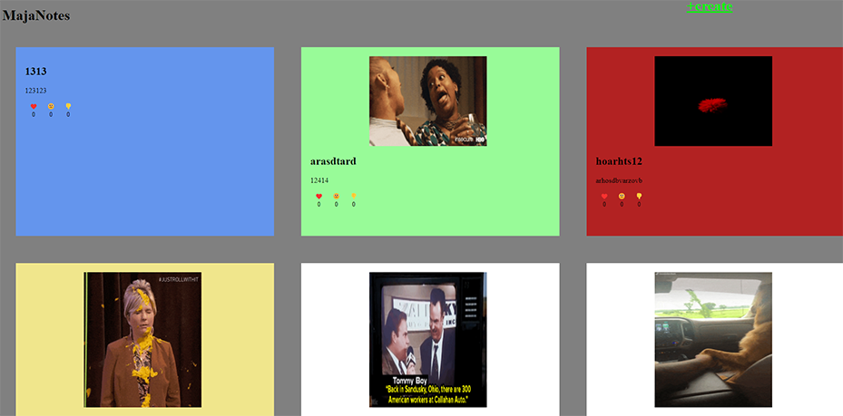
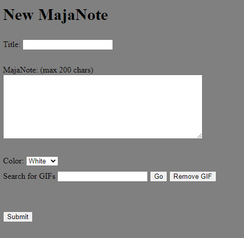

<!-- improve this README by following https://github.com/getfutureproof/fp_guides_wiki/wiki/Writing-READMEs -->
# Majanotes

Anonymous journalling application built by 
* Jesse Dodoo (jessedodoo)
* Alina Laura Vizitiu (AlinaLauraV)
* Michael Nelson (mwezn)
* Andrew Upton (nottnottloop)

Made as a group project for futureproof

# Installation & usage
After cloning, run `npm install` to install all dependencies

Then run `npm run dev` to start a server on http://localhost:3000

# Technologies
* [Express](https://expressjs.com/)
* [EJS](https://ejs.co/)
* [Giphy API](https://developers.giphy.com/)

# Process
Initially we wrote most of the backend with a bad frontend:

# License

[CC-BY-SA 4.0](https://creativecommons.org/licenses/by-sa/4.0/) (?????????)

# Wins & Challenges
## Wins
Additional features include:
* Scoring system based on the popularity of a post, determined by its emoji count
	* More popular posts are placed higher in the feed
* Good server-side data verfication. Posts are not allowed if they don't have a title or body, or if the title and body are too long
	* Errors are displayed individually if there are multiple errors
	* All HTML tags are converted to ampersand character codes before being saved so HTML injection cannot occur
## Challenges